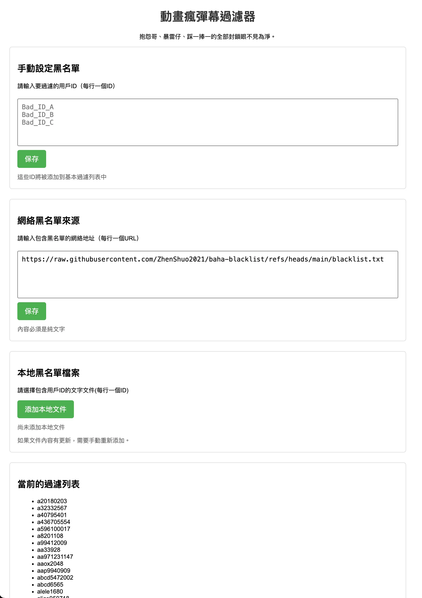
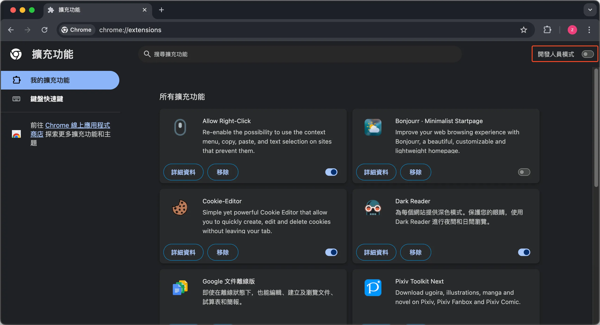
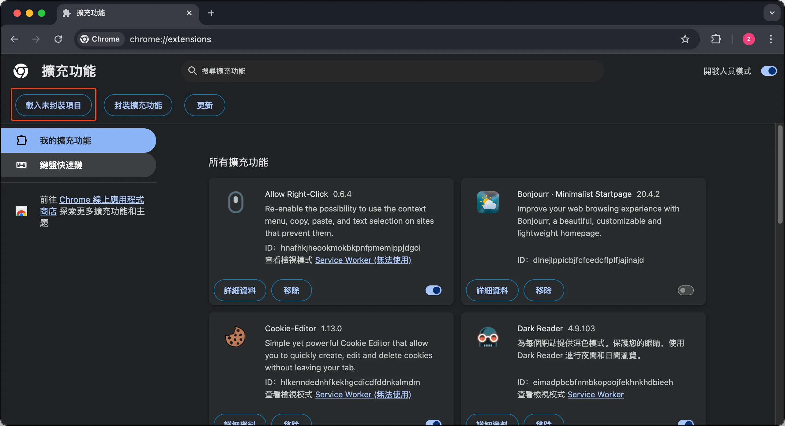
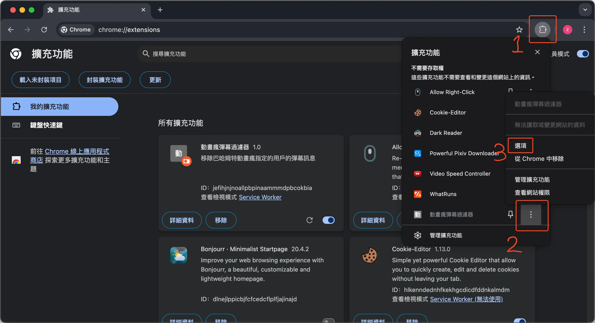

# 巴哈姆特黑名單工具 + 黑名單清單

巴哈黑名單的自動化工具，同時包括黑名單清單。

## 簡介

只想開心看動畫但是彈幕總是有人在抱怨和暴雷，把他們都 ban 了之後想說可以分享這個名單，又發現巴哈沒有匯入工具所以自己寫了一個黑單工具。

有兩種使用方式

- [使用瀏覽器擴充功能](#extension)：容易使用，原理是進入網頁取得彈幕數據時，擴充功能會過濾指定用戶的彈幕留言。
- [使用 Python 腳本](#python-script)：功能是匯入和匯出帳號的黑名單，加入黑名單後系統發送的彈幕就不會包含黑名單帳戶的彈幕，此方式比較適合黑名單提供者使用。

兩者是獨立的方案，都可以完成彈幕過濾，擴充功能是叫 AI 寫的，Python 則是我自己寫的。

<h2 id="extension">瀏覽器擴充功能</h2>

使用範例



### 安裝

1. 下載此專案
2. 開啟 Chrome 瀏覽器，進入 `chrome://extensions/`
3. 開啟右上角「開發人員模式」



4. 點擊「載入未封裝項目」，選擇 `chrome-extension` 資料夾



5. 進入設定頁面設定你的黑名單來源



預設載入我的黑名單清單，也可以換成任意來源的清單，只要格式是一行一個 id 即可。

<h2 id="python-script">Python 腳本</h2>

使用範例

https://github.com/user-attachments/assets/43bf36fa-8c4d-429c-a5f0-22c3fd7e6512

### 說明

主要提供以下三個功能

1. 根據黑名單來源自動更新黑名單
2. 匯出自己的黑名單
3. 從原有的黑名單中移除特定條件的用戶

特定條件是登入次數小於一定次數或者上次登入日期過久的用戶，因為看到這些用戶的機會很小了，所以移除這些人的黑名單空出給其他人（巴哈黑名單[人數上限 1500](https://forum.gamer.com.tw/C.php?bsn=60404&snA=39366)）。

### 安裝和使用

下載腳本後

1. [安裝 uv](https://docs.astral.sh/uv/getting-started/installation/)
2. 移動到專案目錄 `cd baha-blacklist`
3. 執行腳本

```sh
uv run baha-blacklist -a <帳號> -p <密碼>
```

預設三種功能都會執行，使用 `-h` 參數可以看到所有輸入選項。修改 config.json 就可以從中讀取設定檔，不再需要在命令行輸入帳號密碼。

### 注意事項

1. Cookies 登入方式是使用 [Cookie-Editor](https://chromewebstore.google.com/detail/cookie-editor/hlkenndednhfkekhgcdicdfddnkalmdm) 匯出 netscape 格式的 cookie 並且儲存到同資料夾的 `cookies.txt`。根據 [aniGamerPlus](https://github.com/miyouzi/aniGamerPlus) 的建議可以使用無痕瀏覽器登入巴哈以取得程式碼專用的 cookies。
2. 遇到登入問題可以嘗試更新 cookie 檔案或者是修改 `user_agent`：到 [whatsmyua](https://www.whatsmyua.info/) 取得 `user_agent` 後複製到 `config.json`，並且修改 config.json 中的 browser 版本，在兩者版盡量相同最好，browser 可用版本請見[支援的瀏覽器清單](https://curl-cffi.readthedocs.io/en/latest/impersonate.html)。
3. 等待時間久一點讓他慢慢跑沒關係，設定太快對網站來說是攻擊，帳號可能會被 ban。
4. 黑名單來源 `blacklist_src` 預設根據[我的黑名單](https://github.com/ZhenShuo2021/baha-blacklist/blob/main/blacklist.txt)更新，已經 ban 了很多碎念大師和暴雷哥，也可以用你找到的黑名單列表進行更新，只要格式是一行一個的文字檔就可以使用。

# Disclaimer

This tool is provided "as is," and the creator makes no guarantees regarding the functionality or reliability of the tool. By using this tool, you acknowledge and accept that the use of automated systems may lead to account bans or other negative consequences, and the creator is not responsible for any resulting issues. The tool is intended solely for personal use and must not be used for any illegal activities, commercial purposes, or any action that violates terms of service of any platform. Unauthorized or harmful use of this tool may result in legal action. The creator disclaims any responsibility for damages caused by improper or unintended usage.

# Acknowledgment

The password login functionality is derived from the project "BahaMaster" by davidleitw, available at https://github.com/davidleitw/BahaMaster.
